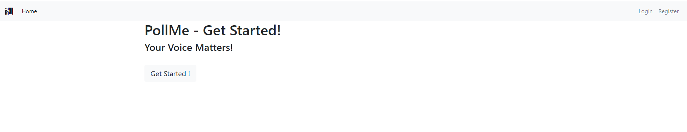

# ansible_project
Ансибл плэйбук для разворачивания отказоустойчивого кластера для запуска 
приложений на Django + Gunicorn на чистой системе с Rocky Linux.

## Содержание
* [Общая информация](#Общая-информация)
* [Роли](#Роли)
  * [ОС](#ОС)
  * [Инфраструктура](#Инфраструктура)

## Общая информация 
Плэйбук позволяет установить отказоустойчивый кластер для запуска
Django с нуля.

#### Инфраструктура
В качестве инфраструктуры используются 3 ноды БД, 2 для приложений
и 1 для мониторинга.

#### Отказоустойчивость
Отказоустойчивость БД обеспечивается кластером patroni, веб сервер 
содержит 2 ноды с балансировкой нагрузки через nginx.

#### Мониторинг
Мониторинг осуществляется связкой Prometheus + Grafana, статистика
собирается с помощью Node Exporter и Django Exporter.

#### Безопасность
Плэйбук открывает в firewalld порты, необходимые сервисам и на 
нодах приложений добавляет разрешение для nginx в SeLinux.
Так же данные пользователей, создаваемых плэйбуком зашифрованы 
(ключ лежит в проекте для демонстрации).

#### Взаимодействие
Для взаимодействия между сервисами собирается Консул-кластер

#### Приложение
В плэйбуке используется приложение PollMe 
https://github.com/devmahmud/Django-Poll-App.git



# Роли
В плэйбуке используется 5 основных ролей - ОС, инфраструктура, БД, 
мониторинг и приложение. Для каждой роли есть отдельный плэйбук, 
так же есть общий плэйбук 
```
full_install.yml
```

## ОС
Эта роль подготавливает систему для дальнейшей работы, устанавливая 
общие пакеты, настраивая ntp (в качестве ntp используется chrony) и 
logrotate и открывая необходимые порты на файрволле. Так как роль 
прогоняется на всех хостах в плэйбуке она объединена с ролью инфраструктуры

## Инфраструктура
укеавп


