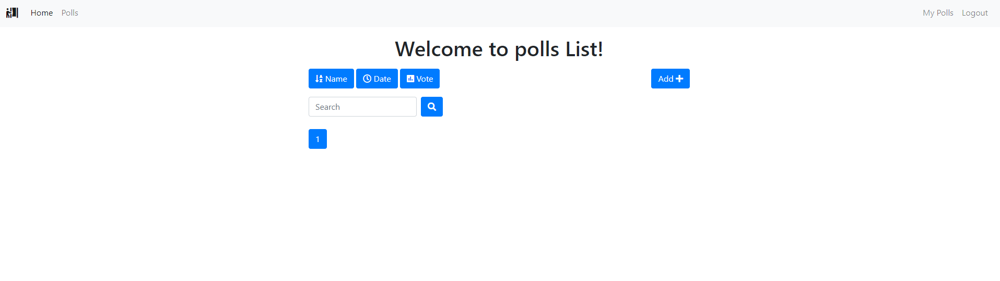

# ansible_project
Ансибл плэйбук для разворачивания отказоустойчивого кластера для запуска 
приложений на Django + Gunicorn на чистой системе с Rocky Linux.

## Содержание
* [Общая информация](#Общая-информация)
* [Роли](#Роли)
  * [ОС](#ОС)
  * [Инфраструктура](#Инфраструктура-1)
  * [БД](#БД-1)
  * [Мониторинг](#Мониторинг-1)
  * [Приложение](#Приложение-1)
* [Результат](#Результат)

## Общая информация 
Плэйбук позволяет установить отказоустойчивый кластер для запуска
Django с нуля.

#### Инфраструктура
В качестве инфраструктуры используются 3 ноды БД, 2 для приложений
и 1 для мониторинга.

#### Отказоустойчивость
Отказоустойчивость БД обеспечивается кластером patroni, веб сервер 
содержит 2 ноды с балансировкой нагрузки через nginx.

#### Мониторинг
Мониторинг осуществляется связкой Prometheus + Grafana, данные
собираются с помощью Node Exporter и Django Exporter.

#### Безопасность
Плэйбук открывает в firewalld порты, необходимые сервисам и на 
нодах приложений добавляет разрешение для nginx в SeLinux.
Так же данные пользователей, создаваемых плэйбуком зашифрованы 
(ключ лежит в проекте для демонстрации).

#### Взаимодействие
Для взаимодействия между сервисами собирается Консул-кластер

#### Приложение
В плэйбуке используется приложение PollMe 
https://github.com/devmahmud/Django-Poll-App.git


# Роли
В плэйбуке используется 5 основных ролей - ОС, инфраструктура, БД, 
мониторинг и приложение. Для каждой роли есть отдельный плэйбук, 
так же есть общий плэйбук 
```
full_install.yml
```

## ОС
Эта роль подготавливает систему для дальнейшей работы, устанавливая 
общие пакеты, настраивая ntp (в качестве ntp используется chrony) и 
logrotate и открывая необходимые порты на файрволле. Так как роль 
прогоняется на всех хостах в плэйбуке она объединена с ролью инфраструктуры.

## Инфраструктура
Эта роль устанавливает Консул-кластер необходимый для взаимодействия сервисов
друг с другом. Плэйбук ставит 4 мастер ноды и на 2 ноды с приложением ставится
агент.


Для установки этой роли совместно с ОС и Node Exporter используется плэйбук
```
os+consul.yml
```


## БД
Эта роль устанавливает кластер PostgreSQL с репликацией через patroni и 
создаёт пользователей и таблицы, необходимые для работы приложения.
Для взаимодействия с приложением используется Консул, который сообщает
ноду лидера для взаимодействия с БД.


За базу для роли взят плэйбук от vitabaks https://github.com/vitabaks/postgresql_cluster,
подогнанный под нужды проекта.

Для выполнения этой роли необходимо прогнать 
```
os+consul.yml
```
Роль запускается плэйбуком 
```
deploy_pgcluster.yml
```
## Мониторинг
Эта роль устанавливает Grafana + Prometheus. За сбор данных отвечают
Node Exporter и Django Exporter, передают информацию Консулу

откуда её забирает Prometheus

и передаёт Grafana
#### Node Exporter

#### Django Exporter

Для выполнения этой роли необходимо прогнать 
```
os+consul.yml
```
Django Exporter устанавливается ролью "Приложение", он автоматически регистрируется
и зависимости от этой роли нет.

Роль запускается плэйбуком 
```
monitoring.yml
```
#### Приложение
Эта роль устанавливает Django + Gunicorn. В результате прогона роли приложение
 стягивается с репозитория, создаётся виртуальное окружение, соответствующее 
требованиям приложения, производится миграция БД. Для балансировки нагрузки
устанавливается nginx. Приложение готово к использованию.

```
os+consul.yml
deploy_pgcluster.yml
```
Роль запускается плэйбуком 
```
apps.yml
```

# Результат
После прогона полного плэйбука
```
ansible-playbook full_install.yml -i inventory/dev -kKu $user_name
```

Получаем готовое к работе приложение
